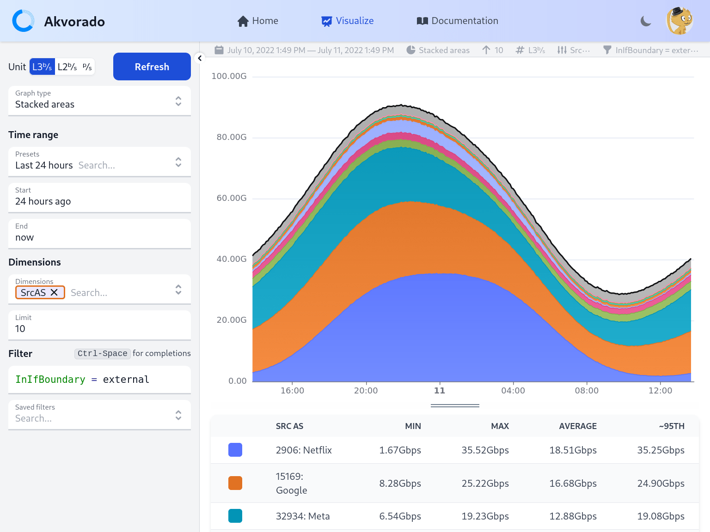
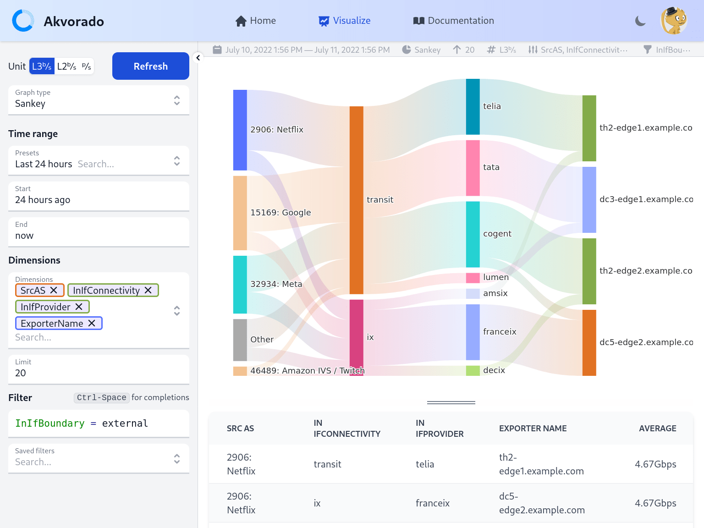

# Akvorado: flow collector, enricher and visualizer &middot; [](https://github.com/akvorado/akvorado/actions/workflows/ci.yml) [](https://codecov.io/gh/akvorado/akvorado) [](LICENSE.txt) [](https://github.com/akvorado/akvorado/releases)

This program receives flows (currently Netflow/IPFIX and sFlow), enriches them
with interface names (using SNMP), geo information (using IPinfo.io),
and exports them to Kafka, then ClickHouse. It also exposes a web
interface to browse the collected data.





*Akvorado* is developed by [Free](https://www.free.fr), a French ISP,
and is licensed under the [AGPLv3 license](LICENSE.txt).

A demo site using fake data and running the latest stable version is
available on [demo.akvorado.net](https://demo.akvorado.net). It is the
direct result of running `docker compose up` on a fresh checkout but
port 2055 is not accessible (you cannot send you own flows). Please,
be gentle with this resource. The demo site also enables you to browse
the [documentation](https://demo.akvorado.net/docs) for the current version
(the one in `docs/` is for the next version).

By default, *Akvorado* is using [IPinfo](https://ipinfo.io) databases for
geolocation data.

Be aware that *Akvorado* is still young and should be considered as beta
quality. Be sure to always read the
[changelog](console/data/docs/99-changelog.md) before upgrading.
# Execução

- ## linux    
    ### Requisitos:
    - go 1.21+
    - node16+ (utilize nvm para instalação)
    ### comandos
    ```bash
    make
    docker compose up -d
    ```
- ## Windows    
    ### Requisitos:
    - go 1.21+
    - node16+ (utilize nvm para instalação)
    - wsl (como ativar e configurar [wsl](#Activate-wsl2)
    ### comandos
    execute os comandos no wsl
    ```bash
    sudo apt-get install make
    
    make
    
    docker compose up -d
    ```
---
## Activate wsl2
```powershell
dism.exe /online /enable-feature /featurename:Microsoft-Windows-Subsystem-Linux /all /norestart
dism.exe /online /enable-feature /featurename:VirtualMachinePlatform /all /norestart
wsl --set-default-version 2
```

## Install and Configure Ubuntu

```powershell
# install ubuntu from the store
# open the ubuntu app
# set username and password
# close the ubuntu app
wsl --set-version Ubuntu 2
```


## Install Docker & Docker-compose on Ubuntu

```bash
#Refresh and install packages
sudo apt-get update
sudo apt-get install -y apt-transport-https ca-certificates curl software-properties-common libssl-dev libffi-dev git wget nano

#Add user group
sudo groupadd docker
sudo usermod -aG docker ${USER}

#Add docker key and repo
curl -fsSL https://download.docker.com/linux/ubuntu/gpg | sudo apt-key add -
sudo add-apt-repository "deb [arch=amd64] https://download.docker.com/linux/ubuntu $(lsb_release -cs) stable"
sudo apt-get update

#Install docker and docker-compose
sudo apt-get install -y docker-ce containerd.io docker-compose

#Install docker-compose (if the previous command failed to install)
sudo curl -sSL https://github.com/docker/compose/releases/download/v`curl -s https://github.com/docker/compose/tags | grep "compose/releases/tag" | sed -r 's|.*([0-9]+\.[0-9]+\.[0-9]+).*|\1|p' | head -n 1`/docker-compose-`uname -s`-`uname -m` -o /usr/local/bin/docker-compose && sudo chmod +x /usr/local/bin/docker-compose
```

## Run docker on startup
```bash
echo "sudo service docker start" >> ~/.profile
#echo "cd /mnt/" >> ~/.profile
source ~/.profile
```

## Considerations

```powershell
#To restart wsl (use in case it didn't work)
wsl --shutdown

# to communicate containers don't use localhost, point to: [ubuntu terminal] - the first ip that appears
ip addr | grep eth0 | grep inet

# for for ensuring docker service is running on startup to workaround having to deal with sudo
wsl.exe -u root service docker status || wsl.exe -u root service docker start
```

## Limit resources

1. Enter the user's folder. C:\Users\USER
2. Create the file: *.wslconfig*
3. Enter the following:
```properties
[wsl2]
memory = 4GB # Limits memory
processors = 2 # Limits virtual processors
```
4. Save and restart the *LxssManager* service

# Ejecución

- ## Linux    
    ### Requisitos:
    - go 1.21+
    - node16+ (utilice nvm para la instalación)
    ### comandos
    ```bash
    make
    docker compose up -d
    ```
- ## Windows    
    ### Requisitos:
    - go 1.21+
    - node16+ (utilice nvm para la instalación)
    - wsl (cómo activar y configurar [wsl](#Activate-wsl2)
    ### comandos
    ejecute los comandos en wsl
    ```bash
    sudo apt-get install make
    
    make
    
    docker compose up -d
    ```
---
## Activar wsl2
```powershell
dism.exe /online /enable-feature /featurename:Microsoft-Windows-Subsystem-Linux /all /norestart
dism.exe /online /enable-feature /featurename:VirtualMachinePlatform /all /norestart
wsl --set-default-version 2
```

## Instalar y Configurar Ubuntu

```powershell
# instalar ubuntu desde la tienda
# abrir la aplicación de ubuntu
# establecer nombre de usuario y contraseña
# cerrar la aplicación de ubuntu
wsl --set-version Ubuntu 2
```


## Instalar Docker y Docker-compose en Ubuntu

```bash
#Actualizar y instalar paquetes
sudo apt-get update
sudo apt-get install -y apt-transport-https ca-certificates curl software-properties-common libssl-dev libffi-dev git wget nano

#Agregar grupo de usuarios
sudo groupadd docker
sudo usermod -aG docker ${USER}

#Agregar clave y repositorio de docker
curl -fsSL https://download.docker.com/linux/ubuntu/gpg | sudo apt-key add -
sudo add-apt-repository "deb [arch=amd64] https://download.docker.com/linux/ubuntu $(lsb_release -cs) stable"
sudo apt-get update

#Instalar docker y docker-compose
sudo apt-get install -y docker-ce containerd.io docker-compose

#Instalar docker-compose (si el comando anterior falló en la instalación)
sudo curl -sSL https://github.com/docker/compose/releases/download/v`curl -s https://github.com/docker/compose/tags | grep "compose/releases/tag" | sed -r 's|.*([0-9]+\.[0-9]+\.[0-9]+).*|\1|p' | head -n 1`/docker-compose-`uname -s`-`uname -m` -o /usr/local/bin/docker-compose && sudo chmod +x /usr/local/bin/docker-compose
```

## Ejecutar docker al inicio
```bash
echo "sudo service docker start" >> ~/.profile
#echo "cd /mnt/" >> ~/.profile
source ~/.profile
```

## Consideraciones

```powershell
#Para reiniciar wsl (usar en caso de que no funcione)
wsl --shutdown

# para comunicar contenedores no use localhost, apunte a: [terminal de ubuntu] - la primera ip que aparece
ip addr | grep eth0 | grep inet

# para asegurar que el servicio docker esté en ejecución al inicio para evitar tener que usar sudo
wsl.exe -u root service docker status || wsl.exe -u root service docker start
```

## Limitar recursos

1. Entre en la carpeta del usuario. C:\Users\USER
2. Cree el archivo: *.wslconfig*
3. Ingrese lo siguiente:
```properties
[wsl2]
memory = 4GB # Limita la memoria
processors = 2 # Limita los procesadores virtuales
```
4. Guarde y reinicie el servicio *LxssManager*